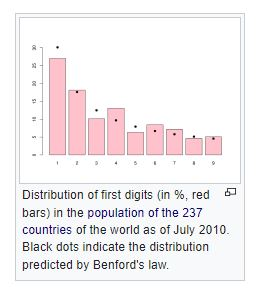
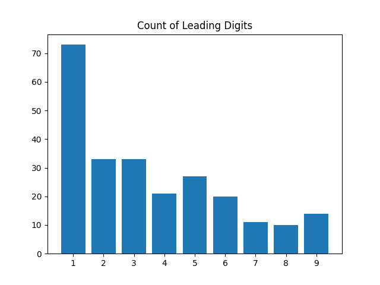

# Benford's Law Validation

> Benford's law, also known as the Newcomb–Benford law, the law of anomalous numbers, or the first-digit law, is an observation that in many real-life sets of numerical data, the leading digit is likely to be small. In sets that obey the law, the number 1 appears as the leading significant digit about 30 % of the time, while 9 appears as the leading significant digit less than 5 % of the time. If the digits were distributed uniformly, they would each occur about 11.1 % of the time. Benford's law also makes predictions about the distribution of second digits, third digits, digit combinations, and so on.

[Benford's Law](https://en.wikipedia.org/wiki/Benford%27s_law)
Read [more](https://mathworld.wolfram.com/BenfordsLaw.html)

The code is the easy graph example of count of leading digits, the example taken is from wikipedia data of population of 237 countries as of July 2010

Graph from Wiki

Code Generated Graph

